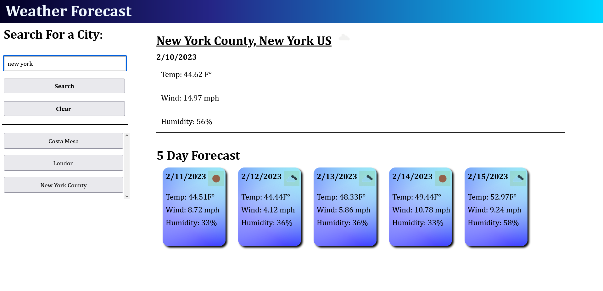
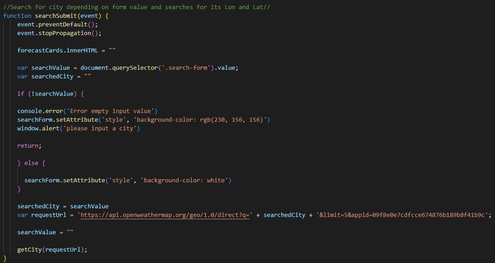
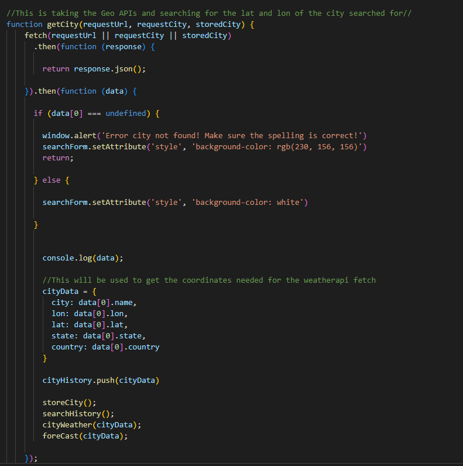
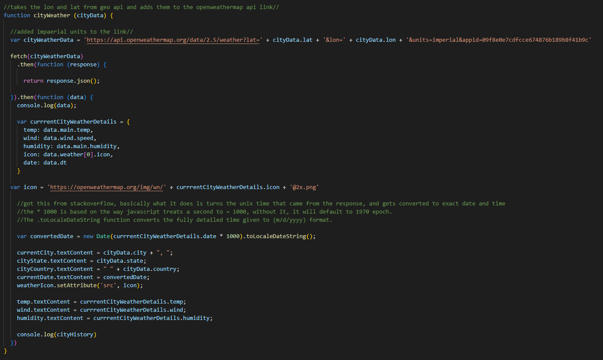
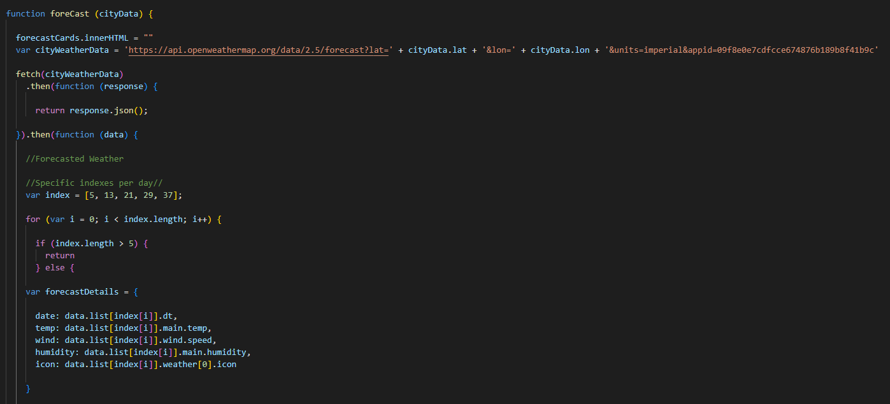
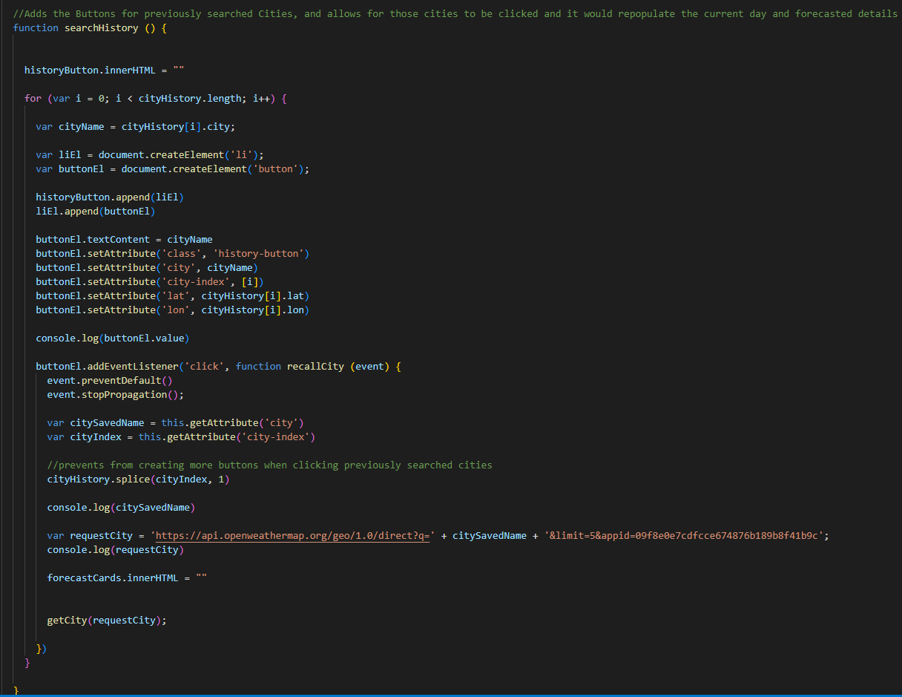
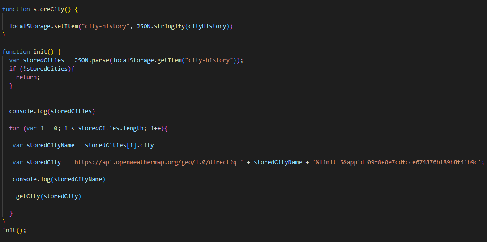

# Challenge-6-Weather-Forecast
A weather report application that demonstrates a 5 day forecast, depending on the city searched.

## Deployed Site

https://nshaw973.github.io/Challenge-6-Weather-Forecast/

## The Work

The tast for this weeks challenge involved creating a weather forecast application, which used the openweathermap API alonside the geocoding API to get specific cities weather conditions, both current and for the next 5 days.

Here is what the application turned out looking like.

 

First challenge was to just get the CSS going and general page structure going. More time consuming than it was actually brainstorming code. This helped give direction as to where to start the application.

Once the general html and css was done, the first main task was to get a working form submission that would be used to search for cities, by taking the content of the form and adding them to the api url so that

 

After the url has been completed, it was time to take the geocoding API to a fetch function to get the Latitude and Longitude of the city, since it's what the openweather API is asking for in order to get the cities forecast.



If the link turns out to find nothing due to the user making a typo, or searching with an empty form, the form will turn red to alert the user that something went wrong and they need to retry their search. If the user did type in an existing city, then a response will then be made. With that response we also get information regarding the proper name for the city, the lat, lon, state, and country. Which we will use to create the buttons for previously searched cities, so that we have proper names. Also will be using that data for the main side of the weather forecast details to populate the city, state (if any), and country.

With the lat and lon now in a value form. It was time to fetch the actual weather conditions from the openweather API



With the Lat and Lon inserted into the fetch link, which I also had to add the &units=imperial parameter to the link in order to get the temperature in imperial units aka Fahrenheit.
Just like the city details, I converted the details for the cities weather into a single object in order to move it around a little more freely.
now it was time to start populating the current day weather details by filling the empty html contents with both the city details, and weather details object.

The big one here was getting the proper date that would change dynamically based on the day the application was opened.

by invoking the 

      var forecastDate = new Date(forecastDetails.date * 1000).toLocaleDateString();

I am able to turn the unix code given to me by the weatherAPI, and convert it to an actual date. The reason I multiplied the unix code by 1000 is because of the way js views time as 1000 = 1 second. adding the to localdatestring function turns the super detailed unix code into just the mm/dd/yyyy format.

The icon involved searching google for a second to find the link that the openweather API stores its icon list. All I had to do was get the id from the weather fetch, and insert it into the link.

Then the last fetch needed to be made, the 5 day forecast.



Same as before, just taking the same lat and lon for the city and fetching the data.

The Main difference this time around was getting specific dates and times to populate the cards, since this fetch came with an array of 40, with each object being a 3 hour forecast detail. 

I settled with everyday with 12pm to get the afternoon details. In order to do that I created a new array with the specific objects that had the correct date and time I wanted, and just have it loop through and only use the specific array numbers to create a card for.

The rest of this function was just creating elements and filling them with the weather data and thats about it.

Second to last thing that needed to be done was create the search history.



The main thing about this was just creating a for loop to keep creating the search history buttons that were being stored in the cityHistory array. 
With each button having to act as a way to return to a previously searched city. I took the value of the buttons city attibute and turned that into a variable with a url being injected with that value, which would then be sent back through the fetch process and reload the forecast with updated times and weather conditions as opposed to saving all the info saved before. To avoid opening up the city and seeing yesterday forecast.

Lastly was creating the localStorage for the cities to be stored on page refresh/exit.



Due to the way the code was structured, once the page is initialized, the for loop goes through each object in the stored array, and repopulates them by running the code through every object. bringing back the searched cities.


## User Story

```
AS A traveler
I WANT to see the weather outlook for multiple cities
SO THAT I can plan a trip accordingly
```

## Acceptance Criteria

```
GIVEN a weather dashboard with form inputs
WHEN I search for a city
THEN I am presented with current and future conditions for that city and that city is added to the search history
WHEN I view current weather conditions for that city
THEN I am presented with the city name, the date, an icon representation of weather conditions, the temperature, the humidity, and the wind speed
WHEN I view future weather conditions for that city
THEN I am presented with a 5-day forecast that displays the date, an icon representation of weather conditions, the temperature, the wind speed, and the humidity
WHEN I click on a city in the search history
THEN I am again presented with current and future conditions for that city
```
